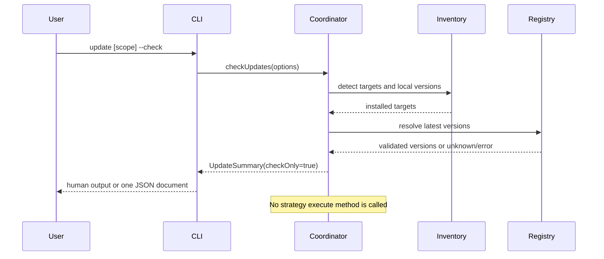
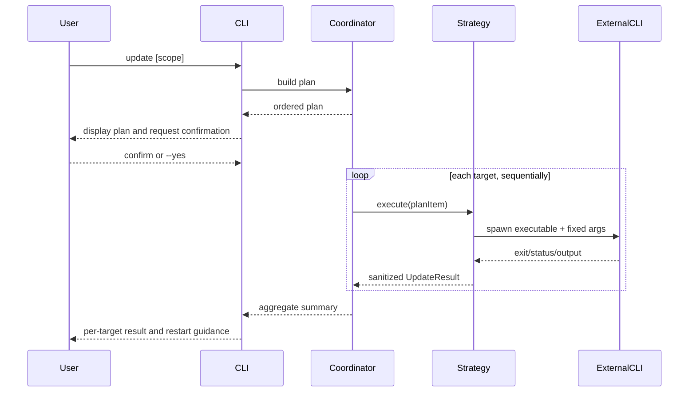
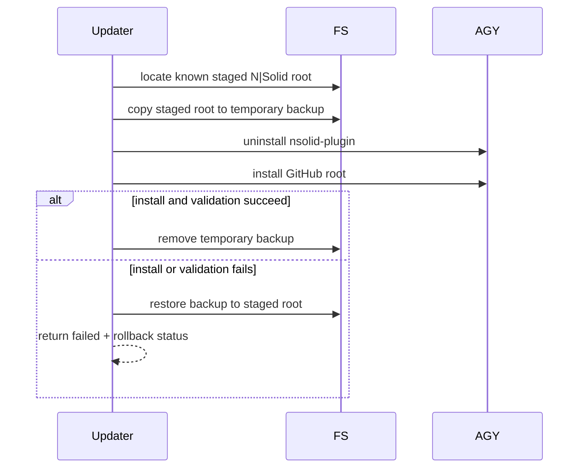
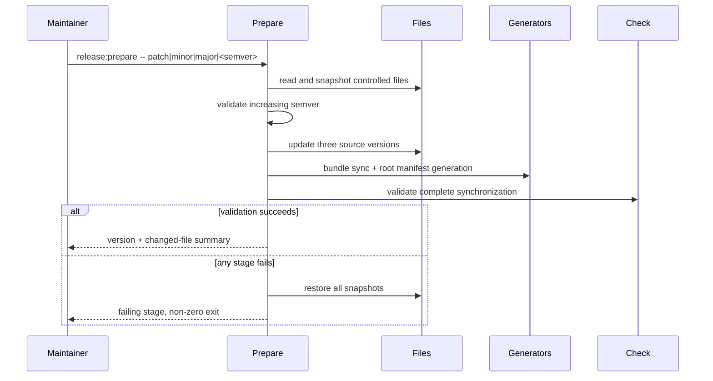

# Design

## Architecture

The update feature is additive to the existing CLI and installer architecture. It does not move installation ownership into the shared CLI: each native harness remains responsible for its own staged plugin, Pi remains package-owned, and OpenCode/fallback installs continue through the existing installer.

The CLI adds an update coordinator that separates four concerns:

1. inventory: determine what is installed and how it is owned;
2. discovery: resolve local and latest versions without mutation;
3. planning: produce deterministic, reviewable update actions; and
4. execution: run approved actions through typed strategies and summarize results.

```text
packages/core/src/cli.ts
          |
          v
packages/core/src/update/coordinator.ts
    |            |             |
    v            v             v
 inventory   version sources   target strategies
    |            |             |
    +------------+-------------+
                 |
                 v
       sanitized UpdateSummary
```

The coordinator never performs OAuth. Existing setup/auth modules are outside the update dependency graph.

Release preparation is a separate maintainer-side script. Runtime update code reads version metadata but never edits repository release files.

## Module Boundaries

### Runtime update modules

`packages/core/src/update/types.ts`

- Defines target, plan, result, summary, version, and error contracts.
- Contains no filesystem, network, or process behavior.

`packages/core/src/update/coordinator.ts`

- Resolves requested scope (`cli`, one harness, or all detected targets).
- Produces the plan before mutation.
- Applies confirmation rules.
- Executes targets sequentially and isolates per-target failures.
- Owns overall exit/result semantics, not target-specific commands.

`packages/core/src/update/inventory.ts`

- Reuses harness adapters and tracking readers to classify each harness as native, fallback, package-owned, or not installed.
- Reads the running CLI/package metadata.
- Adds optional version discovery without changing existing installation detection contracts.

`packages/core/src/update/version-source.ts`

- Reads and validates `latest` metadata from npm for `nsolid-plugin` and `nsolid-pi-plugin`.
- Reads the GitHub-root `bundle.json` once for native Git targets.
- Applies bounded request timeouts and semantic-version validation.
- Returns `unknown` rather than treating missing version evidence as current.

`packages/core/src/update/package-manager.ts`

- Detects npm or pnpm only from positive installation-path/package-manager evidence.
- Produces a fixed executable plus argument array.
- Returns unsupported for workspaces, `npx`, local checkouts, and ambiguous launchers.

`packages/core/src/update/command-runner.ts`

- Wraps `spawn`/`spawnSync` with `shell: false`.
- Accepts executable and argument arrays, controlled environment additions, timeout, and output mode.
- Redacts tokens, authorization headers, and credential paths from captured diagnostics.
- Is injected in tests so no real package manager or harness command runs.

`packages/core/src/update/strategies/*.ts`

- One strategy per ownership model: CLI package, Claude, Codex, Antigravity, Pi, and fallback.
- Strategies receive an immutable plan item and execution context.
- Strategies cannot broaden scope or switch from native to fallback ownership after failure.

`packages/core/src/update/antigravity-transaction.ts`

- Resolves only known NodeSource staged plugin paths.
- Creates a temporary backup before replacement.
- Validates the newly staged root by checking `plugin.json`, `bundle.json`, and canonical skill presence.
- Restores the backup if reinstall or validation fails.

### Existing modules extended

`packages/core/src/cli.ts`

- Adds `version` and `update` cases, with bare `--version` as an alias for human-readable version reporting.
- Adds `--check` and `--all`.
- Rejects `--all` with `--harness` before calling the coordinator.
- Keeps JSON on stdout and progress/diagnostics on stderr.

`packages/core/src/index.ts`

- Exports programmatic `getVersionInfo()`, `checkUpdates()`, and `update()` functions and their public types.
- Existing setup/install/uninstall APIs remain unchanged.

`packages/core/src/harnesses/`

- Native detection may expose optional installed version and staged root.
- Existing adapter methods keep their signatures; additive optional methods or helper functions are preferred.

`packages/core/src/skills/skill-tracker.ts`

- Fallback tracking may add an optional `bundleVersion` for future checks.
- Readers must accept existing tracking files that omit it.

### Release modules

`scripts/prepare-release.mjs`

- Accepts `patch`, `minor`, `major`, or an explicit greater semantic version.
- Treats root `bundle.json.version` as the canonical current release version.
- Snapshots every controlled file before mutation.
- Updates source version files, runs existing bundle/root generators, validates results, and restores snapshots on failure.
- Never invokes Git mutation, pack, publish, or registry authentication.

`scripts/check-release-version.mjs`

- Compares package and generated versions with the root bundle.
- Calls/reuses existing bundle and root-manifest checks.
- Activates release mode only when invoked through `pnpm release:check --release`.
- In release mode, compares the explicit plugin payload allowlist from the Release Versioning specification with the latest semantic-version tag and rejects an unchanged version.

Root package scripts:

```json
{
  "release:prepare": "node scripts/prepare-release.mjs",
  "release:check": "node scripts/check-release-version.mjs"
}
```

The private root package version remains `0.0.0`.

## Interfaces and Contracts

```typescript
export type UpdateTarget =
  | 'cli'
  | 'claude'
  | 'codex'
  | 'opencode'
  | 'antigravity'
  | 'pi'

export type UpdateOwnership =
  | 'global-package'
  | 'native-plugin'
  | 'package-owned'
  | 'fallback'

export type UpdateStatus =
  | 'current'
  | 'update-available'
  | 'updated'
  | 'skipped'
  | 'not-installed'
  | 'unknown'
  | 'failed'

export interface VersionInfo {
  current?: string
  latest?: string
  status: 'current' | 'update-available' | 'newer-than-registry' | 'unknown'
}

export interface UpdateOptions {
  harness?: HarnessType
  all?: boolean
  check?: boolean
  yes?: boolean
  json?: boolean
  verbose?: boolean
  noColor?: boolean
  commandRunner?: CommandRunner
  confirm?: UpdateConfirmation
}

export interface UpdatePlanItem {
  target: UpdateTarget
  ownership: UpdateOwnership
  installed: boolean
  version: VersionInfo
  executable?: string
  args?: readonly string[]
  requiresConfirmation: boolean
  restartHint?: string
}

export interface UpdateResult {
  target: UpdateTarget
  ownership: UpdateOwnership
  status: UpdateStatus
  currentVersion?: string
  resultingVersion?: string
  changed: boolean
  restartHint?: string
  rollbackCommand?: string
  error?: {
    code: string
    message: string
  }
}

export interface UpdateSummary {
  checkOnly: boolean
  results: UpdateResult[]
  counts: Record<UpdateStatus, number>
  success: boolean
}

export interface CommandSpec {
  executable: string
  args: readonly string[]
  cwd?: string
  timeoutMs: number
}

export interface CommandRunner {
  run(spec: CommandSpec): Promise<CommandResult>
}

export interface UpdateStrategy {
  readonly target: UpdateTarget
  plan(context: UpdateContext): Promise<UpdatePlanItem>
  execute(item: UpdatePlanItem, context: UpdateContext): Promise<UpdateResult>
}
```

Rules enforced by these contracts:

- `check` stops after planning/version resolution and never calls `execute`.
- Command arguments are arrays; a shell command string is not part of the contract.
- `error.message` is sanitized and suitable for JSON output.
- An absent version is represented as `unknown`, never coerced to `current`.
- Strategies return data; the CLI formatter owns human-readable output.
- A completed check whose result is `update-available` is successful and exits zero; lookup, validation, or execution failures remain non-zero.

### Fixed harness command plans

| Target | Native/package action | Success guidance |
|---|---|---|
| CLI npm | `npm install -g nsolid-plugin@<version>` | invoke CLI again |
| CLI pnpm | `pnpm add -g nsolid-plugin@<version>` | invoke CLI again |
| Claude | `claude plugin update nsolid-plugin@nodesource` | `/reload-plugins` or restart |
| Codex | `codex plugin marketplace upgrade nodesource` | start a new session |
| Antigravity | `agy plugin uninstall nsolid-plugin`, then install Git URL | restart AGY |
| Pi | `pi update npm:nsolid-pi-plugin` | `/reload` or restart |
| Fallback/OpenCode | latest published CLI executes `install --harness <target>` | restart harness if needed |

No user-derived string is interpolated into an executable shell command.

The Codex command plan is provisional until Task 6 verifies it against a disposable real installation. Implementing the Codex strategy is blocked on evidence that `marketplace upgrade` refreshes the already-installed plugin, not only marketplace metadata. If it does not, the design and specification must be amended before implementation to use the documented plugin remove/add lifecycle and to cover configuration preservation.

## Data Flow

### Check-only flow



### Mutating update flow



CLI self-update is planned first, but the running process does not dynamically import the newly installed package. Remaining already-planned harness strategies execute from the current process. The user must invoke the CLI again to use new CLI code.

### Antigravity replacement transaction



### Release preparation



## Error Handling and Safety

- Network lookups have explicit timeouts and schema validation.
- Missing executables use a distinct error code from command failure.
- Process output is bounded before being retained in results.
- Existing logger redaction is applied to verbose diagnostics.
- `--all` catches errors at the target boundary and continues with independent targets.
- Confirmation is mandatory for mutable non-interactive operations unless `--yes` is present.
- Antigravity backup paths are created with restrictive permissions in an OS temporary directory and always cleaned after success.
- Update does not invoke setup, login, or auth modules.
- Release scripts snapshot only an explicit allowlist; rollback never performs broad Git or recursive workspace resets.

## Migration Strategy

This is an additive migration.

1. Add pure types, semantic-version comparison, command runner, and version sources with unit tests.
2. Add inventory and target strategies behind programmatic APIs.
3. Add CLI parsing/formatting and integration tests.
4. Add release preparation/check scripts and fixture tests.
5. Add optional fallback tracking version while preserving reads of legacy tracking files.
6. Update README/package documentation.
7. Ship the feature in a new minor CLI release because it adds public commands; existing `1.0.x` install/setup behavior remains compatible.

Deployment order:

1. Merge version-bearing root manifests and update implementation.
2. Publish the new `nsolid-plugin` package.
3. Publish the same-version `nsolid-pi-plugin` package.
4. Push the matching semantic Git tag.
5. Verify update checks and actual updates from clean fixture homes for every harness.

The update command is useful immediately for future releases; the first release containing it is still installed through the existing manual npm/native update instructions.
