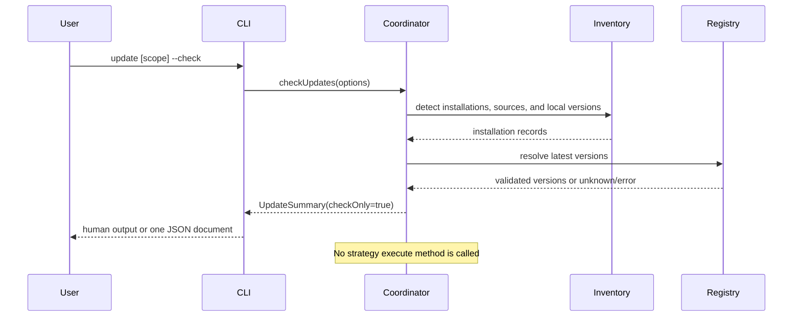
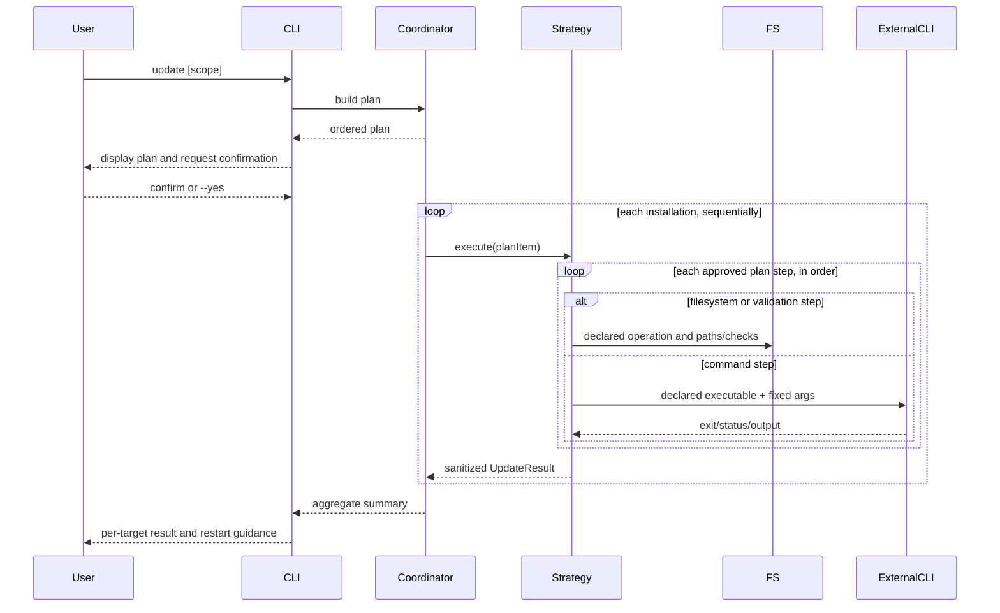
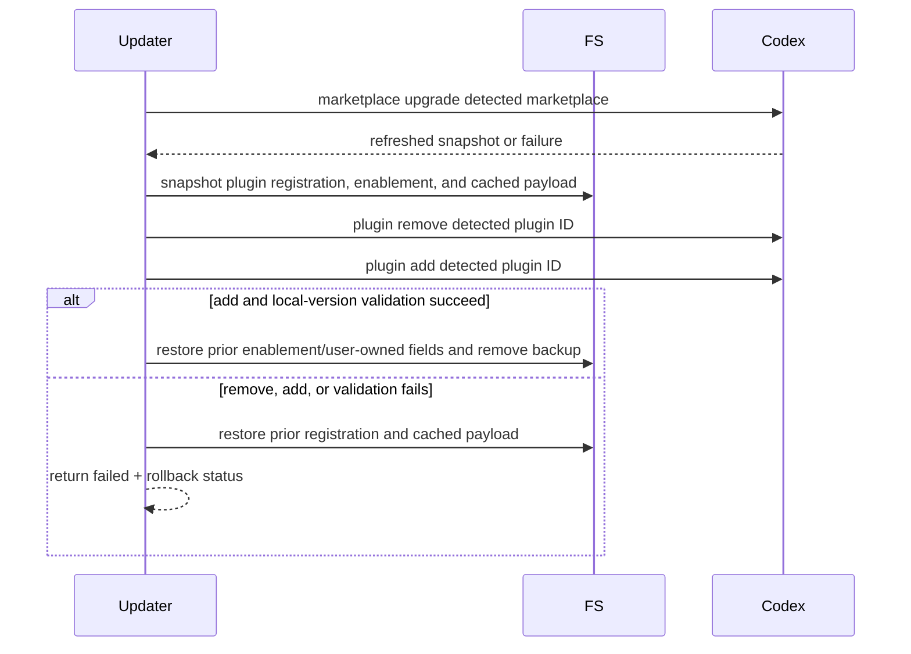
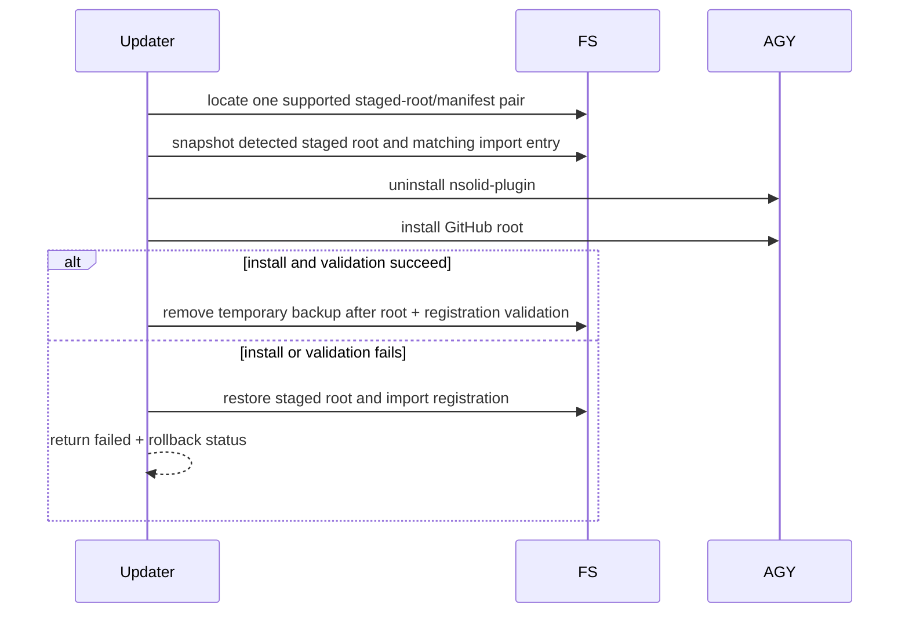
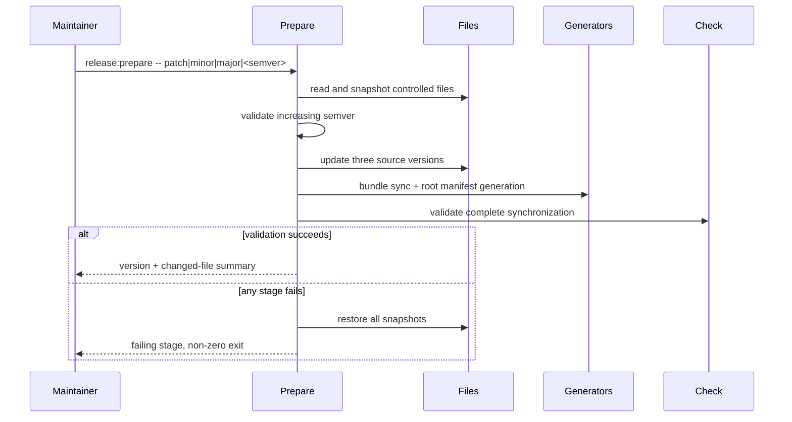

# Design

## Architecture

The update feature is additive to the existing CLI and installer architecture. It does not move installation ownership into the shared CLI: each native harness remains responsible for its own staged plugin, Pi remains package-owned, and initial OpenCode/fallback installs continue through the existing public installer while update-only reconciliation uses the package-internal refresh entrypoint.

The CLI adds an update coordinator that separates four concerns:

1. inventory: determine what is installed and how it is owned;
2. discovery: resolve local and latest versions without mutation;
3. planning: produce deterministic, reviewable update actions; and
4. execution: run approved actions through typed strategies and summarize results.

```text
packages/core/src/cli.ts
          |
          v
packages/core/src/update/coordinator.ts
    |            |             |
    v            v             v
 inventory   version sources   target strategies
    |            |             |
    +------------+-------------+
                 |
                 v
       sanitized UpdateSummary
```

The coordinator never performs OAuth. Existing setup/auth modules are outside the update dependency graph.

Release preparation is a separate maintainer-side script. Runtime update code reads version metadata but never edits repository release files.

## Module Boundaries

### Runtime update modules

`packages/core/src/update/types.ts`

- Defines target, plan, result, summary, version, and error contracts.
- Contains no filesystem, network, or process behavior.

`packages/core/src/update/coordinator.ts`

- Resolves requested scope (`cli`, one harness, or all detected targets).
- Produces one synthetic `ownership: 'none'` item only when an explicitly requested harness has no detected installation.
- Produces the plan before mutation.
- Applies confirmation rules.
- Executes targets sequentially and isolates per-target failures.
- Owns overall exit/result semantics, not target-specific commands.

`packages/core/src/update/inventory.ts`

- Reuses harness adapters and tracking readers to return one installation record per detected native, fallback, or package-owned installation; native and fallback records for the same harness are not collapsed.
- Reads the running CLI/package metadata.
- Carries validated source identity (Claude plugin ID/marketplace/scope/version source, Codex plugin ID/marketplace/version source, Antigravity layout, effective Pi source/scopes, or fallback provenance/executor) into each plan item without changing existing installation detection contracts.
- Treats local, pinned, ambiguous, or otherwise unsupported update sources as `unsupported` instead of substituting a different source.

`packages/core/src/update/version-source.ts`

- Reads and validates `latest` metadata from npm for `nsolid-plugin` and `nsolid-pi-plugin`.
- Resolves Claude/Codex latest-version evidence only from the exact carried marketplace source: a validated Git repository/ref plus relative manifest path, or the detected local marketplace snapshot. It never substitutes the canonical NodeSource GitHub root for an alternate marketplace.
- Reads the canonical GitHub-root `bundle.json` only for fixed-source native Git targets such as Antigravity.
- Applies bounded request timeouts and semantic-version validation.
- Returns `unknown` rather than treating missing, local-stale, ambiguous, or unsupported marketplace version evidence as current; native execution may still use the preserved harness-owned ID when its identity is unambiguous.

`packages/core/src/update/package-manager.ts`

- Detects npm or pnpm only when the real CLI package/entrypoint is contained by that manager's reported global root and the corresponding executable is available; a shim or package-manager environment variable alone is not sufficient evidence.
- Produces a fixed executable plus argument array.
- Pins update and rollback package specs to the exact semantic versions resolved during planning.
- Returns unsupported for workspaces, `npx`, local checkouts, Volta/Yarn/Bun ownership, mismatched global roots, and ambiguous launchers.

`packages/core/src/update/command-runner.ts`

- Wraps `spawn`/`spawnSync` with `shell: false`.
- Accepts executable and argument arrays, controlled environment additions, timeout, and output mode.
- Redacts tokens, authorization headers, and credential paths from captured diagnostics.
- Is injected in tests so no real package manager or harness command runs.

`packages/core/src/update/strategies/*.ts`

- One strategy per ownership model: CLI package, Claude, Codex, Antigravity, Pi, and fallback.
- Strategies receive an immutable plan item and execution context.
- Strategies cannot broaden scope or switch from native to fallback ownership after failure.

`packages/core/src/update/codex-transaction.ts`

- Refreshes only the detected Git marketplace snapshot before touching the installed plugin; marketplace refresh is not treated as an installed-plugin update.
- Snapshots the exact `nsolid-plugin@<marketplace>` registration, prior enabled state, user-owned plugin fields, and cached installed payload before removal.
- Runs `codex plugin remove <detected-plugin-id>` followed by `codex plugin add <detected-plugin-id>` with fixed argument arrays.
- Validates that the reinstalled local version/content matches the refreshed marketplace entry, then reapplies the prior enabled state and preserves unrelated Codex configuration.
- Restores the saved registration and cached payload if removal succeeds but add or validation fails.

`packages/core/src/update/antigravity-transaction.ts`

- Resolves only the two documented global NodeSource layout pairs: shared Antigravity under `~/.gemini/config/` and AGY CLI under `~/.gemini/antigravity-cli/`.
- Creates a temporary backup before replacement containing the detected staged root and the N|Solid entry in that root's matching `import_manifest.json`.
- Validates the newly staged root by checking `plugin.json`, `bundle.json`, canonical skill presence, and source registration in the import manifest.
- Restores both the staged root and the saved manifest entry if reinstall or validation fails, preserving unrelated manifest imports.

`packages/core/src/update/fallback-transaction.ts`

- Resolves one available package executor (`npm exec` preferred, otherwise `pnpm dlx`), pins the child package to the exact validated `nsolid-plugin@<version>` selected during planning, and runs it from a restrictive temporary working directory so workspace binaries/configuration cannot shadow the payload.
- Invokes the exact package's dedicated internal `nsolid-plugin-refresh-owned` binary for only the planned harness; the regular `nsolid-plugin install` command and programmatic `install()` contract are not changed.
- The exact child snapshots the target's tracked NodeSource-owned skill directories, affected MCP configuration, and complete tracking state before mutation, using its own bundled payload for ownership/collision preflight.
- Reconciles the installed asset set against the new bundle: complete skill directories are replaced, previously tracked skills absent from the new bundle are removed, and untracked/user-owned paths and unrelated MCP entries are preserved.
- Updates `bundleVersion` only after the new skills, MCP entries, and tracking data validate; restores the snapshot if execution, reconciliation, or validation fails.
- Treats direct artifacts without sufficient tracking ownership as `unsupported` rather than deleting paths by name or prefix.

### Existing modules extended

`packages/core/src/cli.ts`

- Adds `version` and `update` cases, with bare `--version` as an alias for human-readable version reporting.
- Adds `--check` and `--all`.
- Rejects `--all` with `--harness` before calling the coordinator.
- Keeps JSON on stdout and progress/diagnostics on stderr.

`packages/core/src/update/refresh-owned-cli.ts`

- Implements the package-internal `nsolid-plugin-refresh-owned` binary used by an older updater to execute the exact published bundle's fallback transaction.
- Is not listed as a public user workflow and refuses absent, ambiguous, or untracked ownership; it never authenticates or broadens the requested harness.
- Leaves the existing `nsolid-plugin install` command and public `install()` behavior unchanged.

`packages/core/src/index.ts`

- Exports synchronous, read-only `getVersionInfo(): RunningVersionInfo` plus asynchronous `checkUpdates()` and `update()` functions and their public types.
- Existing setup/install/uninstall APIs remain unchanged.

`packages/core/src/harnesses/`

- Native detection may expose optional installed version and staged root.
- Existing adapter methods keep their signatures; additive optional methods or helper functions are preferred.

`packages/core/src/skills/skill-tracker.ts`

- Fallback tracking adds an optional `bundleVersion` and retains enough per-harness ownership/path evidence to reconcile obsolete assets safely.
- Readers must accept existing tracking files that omit it.

### Release modules

`scripts/prepare-release.mjs`

- Accepts `patch`, `minor`, `major`, or an explicit greater semantic version.
- Treats root `bundle.json.version` as the canonical current release version.
- Snapshots every controlled file before mutation.
- Updates source version files, runs existing bundle/root generators, validates results, and restores snapshots on failure.
- Never invokes Git mutation, pack, publish, or registry authentication.

`scripts/check-release-version.mjs`

- Compares package and generated versions with the root bundle.
- Calls/reuses existing bundle and root-manifest checks.
- Activates release mode only when invoked through `pnpm release:check --release`.
- In release mode, compares the explicit plugin payload allowlist from the Release Versioning specification with the latest semantic-version tag and rejects an unchanged version.

Root package scripts:

```json
{
  "release:prepare": "node scripts/prepare-release.mjs",
  "release:check": "node scripts/check-release-version.mjs"
}
```

The private root package version remains `0.0.0`.

## Interfaces and Contracts

```typescript
import type { HarnessType } from '../types.js'

export type UpdateTarget =
  | 'cli'
  | 'claude'
  | 'codex'
  | 'opencode'
  | 'antigravity'
  | 'pi'

export type UpdateOwnership =
  | 'global-package'
  | 'native-plugin'
  | 'package-owned'
  | 'fallback'
  | 'none'

export type VersionStatus =
  | 'current'
  | 'update-available'
  | 'newer-than-registry'
  | 'unknown'

export type UpdateStatus =
  | 'current'
  | 'update-available'
  | 'newer-than-registry'
  | 'updated'
  | 'skipped'
  | 'not-installed'
  | 'unsupported'
  | 'unknown'
  | 'failed'

export interface VersionInfo {
  current?: string
  latest?: string
  status: VersionStatus
}

export interface RunningVersionInfo {
  cliVersion: string
  bundleVersion: string
}

export type ClaudePluginScope = 'user' | 'project' | 'local' | 'managed'

export type MarketplaceVersionSource =
  | {
      kind: 'git'
      repository: string
      revision?: string
      manifestPath: string
    }
  | {
      kind: 'local-snapshot'
      root: string
      manifestPath: string
      freshness: 'verified' | 'stale' | 'unknown'
    }
  | {
      kind: 'unknown'
      reason: 'missing-metadata' | 'ambiguous' | 'unsupported'
    }

export type PiPackageLocation =
  | { scopes: readonly ['user'] }
  | { scopes: readonly ['project']; projectRoot: string }
  | { scopes: readonly ['user', 'project']; projectRoot: string }

export type FallbackPackageExecutor = 'npm-exec' | 'pnpm-dlx'

export type AntigravityLayout =
  | {
      kind: 'shared'
      pluginRoot: '~/.gemini/config/plugins/nsolid-plugin'
      manifestPath: '~/.gemini/config/import_manifest.json'
    }
  | {
      kind: 'agy-cli'
      pluginRoot: '~/.gemini/antigravity-cli/plugins/nsolid-plugin'
      manifestPath: '~/.gemini/antigravity-cli/import_manifest.json'
    }

export type UpdateSource =
  | { kind: 'none' }
  | { kind: 'global-package'; packageManager: 'npm' | 'pnpm'; packageName: 'nsolid-plugin' }
  | {
      kind: 'claude-marketplace'
      pluginId: string
      marketplace: string
      scope: ClaudePluginScope
      versionSource: MarketplaceVersionSource
    }
  | {
      kind: 'codex-marketplace'
      pluginId: string
      marketplace: string
      versionSource: MarketplaceVersionSource
    }
  | ({
      kind: 'pi-package'
      spec: 'npm:nsolid-pi-plugin'
    } & PiPackageLocation)
  | {
      kind: 'unsupported'
      source: string
      reason: 'local' | 'git' | 'pinned' | 'ambiguous' | 'conflicting' | 'untracked' | 'unsupported-manager'
    }
  | { kind: 'antigravity-git'; url: 'https://github.com/NodeSource/nsolid-plugin.git'; layout: AntigravityLayout }
  | { kind: 'fallback'; bundleVersion?: string; executor?: FallbackPackageExecutor }

export interface UpdateInstallation {
  installationId: string
  target: UpdateTarget
  ownership: UpdateOwnership
  installed: boolean
  source: UpdateSource
  version: VersionInfo
}

export interface UpdateOptions {
  harness?: HarnessType
  all?: boolean
  check?: boolean
  yes?: boolean
  json?: boolean
  verbose?: boolean
  noColor?: boolean
  commandRunner?: CommandRunner
  confirm?: UpdateConfirmation
}

export type UpdatePlanStep =
  | {
      kind: 'command'
      description: string
      command: CommandSpec
    }
  | {
      kind: 'filesystem'
      description: string
      operation: 'backup' | 'replace' | 'reconcile' | 'restore' | 'cleanup'
      paths: readonly string[]
    }
  | {
      kind: 'validation'
      description: string
      checks: readonly string[]
    }

export interface UpdateError {
  code: string
  message: string
}

export interface UpdatePlanItem {
  installationId: string
  target: UpdateTarget
  ownership: UpdateOwnership
  installed: boolean
  source: UpdateSource
  version: VersionInfo
  steps: readonly UpdatePlanStep[]
  rollbackSteps: readonly UpdatePlanStep[]
  planningError?: UpdateError
  requiresConfirmation: boolean
  restartHint?: string
}

export interface UpdateConfirmationContext {
  items: readonly UpdatePlanItem[]
}

export type UpdateConfirmation = (
  context: UpdateConfirmationContext
) => boolean | Promise<boolean>

export interface UpdateResult {
  installationId: string
  target: UpdateTarget
  ownership: UpdateOwnership
  status: UpdateStatus
  currentVersion?: string
  latestVersion?: string
  resultingVersion?: string
  changed: boolean
  restartHint?: string
  rollbackCommand?: string
  rollback?: {
    attempted: boolean
    succeeded?: boolean
  }
  error?: UpdateError
}

export interface UpdateSummary {
  checkOnly: boolean
  results: UpdateResult[]
  counts: Record<UpdateStatus, number>
  success: boolean
}

export interface CommandSpec {
  executable: string
  args: readonly string[]
  cwd?: string
  env?: Readonly<Record<string, string>>
  timeoutMs: number
}

export interface CommandResult {
  exitCode: number | null
  signal?: NodeJS.Signals
  stdout: string
  stderr: string
  timedOut: boolean
}

export interface CommandRunner {
  run(spec: CommandSpec): Promise<CommandResult>
}

export interface UpdateContext {
  options: Readonly<UpdateOptions>
  commandRunner: CommandRunner
}

export interface UpdateStrategy {
  readonly target: UpdateTarget
  readonly ownership: UpdateOwnership
  plan(installation: UpdateInstallation, context: UpdateContext): Promise<UpdatePlanItem>
  execute(item: UpdatePlanItem, context: UpdateContext): Promise<UpdateResult>
}
```

Rules enforced by these contracts:

- `check` stops after planning/version resolution and never calls `execute`.
- Every command, filesystem mutation, validation, and rollback action is represented as an ordered plan step before confirmation; strategies cannot introduce an undisclosed external command during execution.
- A lookup or validation failure produces a plan item with sanitized `planningError`, empty execute/rollback steps, and `requiresConfirmation: false`. The coordinator converts it to a `failed` result without calling `execute`, while independent items remain executable.
- Command arguments are arrays; a shell command string is not part of the contract. The formatter redacts sensitive environment values and source credentials when displaying a plan.
- `error.message` is sanitized and suitable for JSON output.
- An absent version is represented as `unknown`, never coerced to `current`.
- A detected installation source that cannot be updated safely is represented as `unsupported`, never replaced with a different source.
- `ownership: 'none'` with `source.kind: 'none'` is reserved for the synthetic, non-mutating plan/result produced when an explicitly requested harness has no detected installation. It has empty execute/rollback steps, requires no confirmation, and is never emitted as a detected target under `--all`.
- Marketplace version resolution uses only the `versionSource` carried by the detected Claude or Codex registration. An unknown or stale local source yields `unknown`; it never falls back to the NodeSource marketplace.
- Strategies return data; the CLI formatter owns human-readable output.
- A completed check whose result is `current`, `update-available`, `newer-than-registry`, `unsupported`, or evidence-only `unknown` is informational and exits zero. A timeout, invalid response, or other operational lookup/validation failure is `failed` and remains non-zero.
- A mutating update with `newer-than-registry` performs no downgrade and exits zero; a mutating `unsupported` result exits non-zero with manual guidance.
- A declined plan produces `skipped` results and exits zero.

### Fixed harness command plans

| Target | Native/package action | Success guidance |
|---|---|---|
| CLI npm | `npm install --global nsolid-plugin@<resolved-version>` | invoke CLI again |
| CLI pnpm | `pnpm add --global nsolid-plugin@<resolved-version>` | invoke CLI again |
| Claude | `claude plugin update <detected-plugin-id> --scope <detected-scope>` | `/reload-plugins` or restart |
| Codex | `codex plugin marketplace upgrade <detected-marketplace>`, then `codex plugin remove <detected-plugin-id>` and `codex plugin add <detected-plugin-id>` | start a new session |
| Antigravity | `agy plugin uninstall nsolid-plugin`, then `agy plugin install https://github.com/NodeSource/nsolid-plugin.git` | restart AGY |
| Pi user-only | `pi update npm:nsolid-pi-plugin --no-approve` | `/reload` or restart |
| Pi with detected project scope | `pi update npm:nsolid-pi-plugin --approve` after the project root is disclosed and approved | `/reload` or restart |
| Fallback/OpenCode through npm | `npm exec --yes --package=nsolid-plugin@<resolved-version> -- nsolid-plugin-refresh-owned --harness <target>` inside a fallback transaction | restart harness if needed |
| Fallback/OpenCode through pnpm | `pnpm --package=nsolid-plugin@<resolved-version> dlx nsolid-plugin-refresh-owned --harness <target>` inside a fallback transaction | restart harness if needed |

Marketplace IDs, Claude scopes, package versions, Pi scopes, and package sources are passed as separate arguments only after strict validation. A native ID is accepted only when it matches `nsolid-plugin@[A-Za-z0-9][A-Za-z0-9._-]*`; the base name alone, malformed IDs, control characters, whitespace, ambiguous matches, and a Claude installation whose scope cannot be determined return `unsupported`. Marketplace inventory also carries the exact repository/ref and relative manifest path, or the exact local snapshot path and freshness evidence, used for version resolution. Repository credentials are stripped before data reaches plan or result output; traversal-capable manifest paths and ambiguous source metadata return `unknown` or `unsupported` without canonical-source substitution. The only supported Pi identity is the exact unpinned `npm:nsolid-pi-plugin`. Inventory coalesces canonical user/project entries into one Pi target because one `pi update <source>` invocation updates every matching identity; the discriminated location requires `projectRoot` whenever project scope is present. Any local, Git, pinned, conflicting, or ambiguous matching entry returns `unsupported` for the whole target rather than producing a misleading partial success. No user-derived string is interpolated into an executable shell command.

The planner emits one item per `UpdateInstallation`. If a harness has both native and fallback artifacts, both items remain visible and are updated independently; a native failure never switches to fallback ownership.

The CLI registry lookup resolves the `latest` dist-tag once, validates it as a stable semantic version, and stores that exact version in the immutable plan. Execution never sends `@latest` back to a package manager. npm uses `install --global`; pnpm uses `add --global`. Success requires both a zero child exit and an on-disk package manifest at the positively identified global root whose name/version equal `nsolid-plugin` and the planned version. A failed or mismatched result returns the exact previous-version command for the same manager.

Pi source detection reads both user and current-project settings, including object-form entries and filters. User and project entries for the same unpinned npm package become one command target. A user-only target passes `--no-approve` so an unrelated current directory cannot broaden the operation. A detected project target records and displays its project root and passes `--approve` only after the update plan is approved; this is a one-command trust decision and does not rewrite Pi trust/settings files. Pi's own updater preserves source entries and package filters. Because `pi update <source>` does not accept a target version, the registry version observed during planning is a minimum postcondition rather than an executable argument: the strategy reads and reports the actual package-cache version after Pi completes, accepts a newer valid version published during the run, and fails if any affected cache remains older than the planned version.

OpenCode supports native skills and a separate npm/local plugin system, but the current N|Solid distribution is not registered as an OpenCode plugin. Its owner is therefore the tracked direct installer at `~/.config/opencode/skills/` plus the merged `mcp` entries in `opencode.json(c)`. The updater must not invoke `opencode plugin`. It invokes the exact published N|Solid CLI package's internal `nsolid-plugin-refresh-owned` binary as the payload provider and transaction executor. The existing public `install` flow keeps its idempotent copy/merge semantics and does not acquire stale-asset removal behavior.

The Codex marketplace command refreshes only the configured Git marketplace snapshot. It is therefore a discovery prerequisite, not an installed-plugin update. The strategy must use the detected complete plugin ID for both `remove` and `add`, preserve the prior registration/enablement and cached payload transactionally, and validate the resulting local version against the refreshed marketplace entry.

Command semantics were verified on 2026-08-03 against the official harness documentation:

- Claude documents `claude plugin update <plugin> --scope <scope>` and version-keyed installed caches: <https://code.claude.com/docs/en/plugins-reference#plugin-update>.
- Codex documents marketplace upgrade as refreshing Git marketplace snapshots and exposes plugin install/remove as separate operations: <https://learn.chatgpt.com/docs/developer-commands#codex-plugin-marketplace> and <https://learn.chatgpt.com/docs/app-server#api-overview>.
- Google documents AGY plugin management plus the update sequence as uninstalling the old plugin and installing the new source: <https://antigravity.google/docs/cli/plugins> and <https://docs.cloud.google.com/gemini/data-agents/querydata/sql-mysql/build-context-gemini-cli>.
- npm and pnpm document exact-version global installation through `npm install --global <pkg>@<version>` and `pnpm add --global <pkg>@<version>`: <https://docs.npmjs.com/cli/v11/commands/npm-install> and <https://pnpm.io/cli/add>.
- Pi documents `pi update <source>`, unpinned npm updates, separate user/project caches, project trust flags, and identity-based user/project deduplication: <https://pi.dev/docs/latest/packages> and <https://pi.dev/docs/latest/usage>.
- OpenCode documents global skills under `~/.config/opencode/skills/`; its npm/local plugin system is separate from those direct skill directories: <https://opencode.ai/docs/skills/> and <https://dev.opencode.ai/docs/plugins/>.
- npm and pnpm document exact package execution through `npm exec --package=<pkg>@<version>` and `pnpm dlx <pkg>@<version>`: <https://docs.npmjs.com/cli/v11/commands/npm-exec/> and <https://pnpm.io/cli/dlx>.

## Data Flow

### Check-only flow



### Mutating update flow



CLI self-update is planned first, but the running process does not dynamically import the newly installed package. Remaining already-planned harness strategies execute from the current process. The user must invoke the CLI again to use new CLI code.

### Codex replacement transaction



### Antigravity replacement transaction



### Release preparation



## Error Handling and Safety

- Network lookups have explicit timeouts and schema validation.
- Missing executables use a distinct error code from command failure.
- Process output is bounded before being retained in results.
- Existing logger redaction is applied to verbose diagnostics.
- `--all` catches version-lookup, planning, and execution errors at the installation boundary and continues with independent installation records, including native and fallback records for the same harness.
- Confirmation is mandatory for mutable non-interactive operations unless `--yes` is present.
- Marketplace IDs and Claude scopes are validated before becoming arguments; local, pinned, conflicting, and ambiguous Pi sources are never silently replaced.
- CLI and fallback package execution uses the exact immutable version from the plan; mutable dist-tags are not passed during mutation, and a package-manager success without matching on-disk version evidence is a failure.
- Pi user-only updates pass `--no-approve`; `--approve` is used only when the immutable plan identifies and displays a project-scoped canonical package. Canonical entries across both scopes are updated once, while conflicting/pinned entries block automatic mutation.
- Codex removes the installed plugin only after marketplace refresh and backup succeed. Rollback validates the restored registration and cached payload while preserving unrelated `config.toml` entries.
- Antigravity accepts only one unambiguous documented layout pair. Backup paths are created with restrictive permissions in an OS temporary directory and always cleaned after success. Rollback validates both the staged root and its matching saved import-manifest registration.
- OpenCode/fallback replacement mutates only paths and MCP entries proven to be owned by tracking. The transaction restores overwritten and stale-removed skill directories, config, and tracking together after any failed child execution or validation.
- Update does not invoke setup, login, or auth modules.
- Release scripts snapshot only an explicit allowlist; rollback never performs broad Git or recursive workspace resets.

## Migration Strategy

This is an additive migration.

1. Add pure types, semantic-version comparison, command runner, and version sources with unit tests.
2. Add inventory and target strategies behind programmatic APIs.
3. Add CLI parsing/formatting and integration tests.
4. Add release preparation/check scripts and fixture tests.
5. Extend fallback tracking with optional bundle version and path-level ownership, preserving reads of legacy tracking files, then add transactional direct-install reconciliation behind the package-internal update entrypoint without changing public install semantics.
6. Update README/package documentation.
7. Ship the feature in a new minor CLI release because it adds public commands; existing `1.0.x` install/setup behavior remains compatible.

Deployment order:

1. Merge version-bearing root manifests and update implementation.
2. Publish the new `nsolid-plugin` package.
3. Publish the same-version `nsolid-pi-plugin` package.
4. Push the matching semantic Git tag.
5. Verify update checks and actual updates from clean fixture homes for every harness.

The update command is useful immediately for future releases; the first release containing it is still installed through the existing manual npm/native update instructions.
