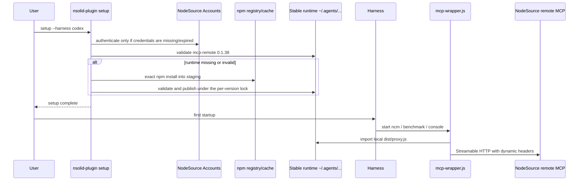

# Design

## Goals / Non-Goals

Goals: provision `mcp-remote@0.1.38` during `setup` into a shared, versioned,
concurrency-safe runtime whose publication is recoverable; make the wrapper
consume only that runtime (or a version-matched dev checkout copy); make
failures fast and actionable; surface the state in `doctor`; preserve
credentials semantics and the current Accounts OAuth untouched.

Non-goals: native MCP-transport OAuth (tracked as deferred technical debt);
automatic pruning of old runtime
versions; byte-for-byte reproducible installs (see Limitations); changing the
Codex 60s startup timeout; offline first-run installation; a portable
gap-free atomic directory swap (not exposed by Node; the publication
protocol below constrains its guarantee accordingly).

## Module Boundaries

### New module: `packages/core/src/mcp/mcp-remote-runtime.ts`

Single ac responsibility: manage the shared bridge runtime under
`getAgentsDir()` (never paths derived from `cwd`). Public (internal-package)
contract:

```ts
export const MCP_REMOTE_VERSION = '0.1.38'

export interface McpRemoteRuntimeStatus {
  status: 'ready' | 'missing' | 'invalid'
  version: string          // pinned version this plugin expects
  root: string             // ~/.agents/nsolid-plugin/runtime/mcp-remote/<version>
  proxyPath?: string       // set when ready
  reason?: string          // why invalid
}

export interface EnsureMcpRemoteRuntimeResult {
  installed: boolean       // false when an already-valid runtime was reused
  version: string
  root: string
  proxyPath: string
}

export interface NpmRunnerRunResult {
  status: number | null
  stderr: string
  timedOut?: boolean
  /** Set when the npm process could not be spawned at all (ENOENT/EACCES/EPERM). */
  spawnError?: string
  /** Set when timeout cancellation could not confirm that the managed tree stopped. */
  terminationError?: string
}

export interface NpmRunner {
  /**
   * Runs npm without a shell. On timeout, terminates the managed npm process
   * tree and confirms that it stopped before cleanup is allowed. If that
   * confirmation fails, returns `terminationError` and the caller leaves
   * staging marked retained-live and excluded from publication/cleanup. Spawn
   * failures surface as `spawnError`, never as a fake exit status.
   */
  run(command: string, args: string[], options: { cwd: string; timeoutMs: number }):
    Promise<NpmRunnerRunResult>
}

export interface InternalRuntimeOptions {
  /** Test-only runner injection; default spawns npm without a shell. */
  runner?: NpmRunner
  /** Override the resolved npm entry point (tests point it at node itself). */
  npmCommand?: { command: string; args: string[] }
  /** Setup-time npm timeout (default 5 min). NOT the Codex MCP startup timeout. */
  timeoutMs?: number
}

export function inspectMcpRemoteRuntime(): McpRemoteRuntimeStatus
export function resolveNpmCommand(): { command: string; args: string[] }
export async function ensureMcpRemoteRuntime(options?: InternalRuntimeOptions): Promise<EnsureMcpRemoteRuntimeResult>
```

`InternalRuntimeOptions` exists solely as the internal testing seam; it is not
re-exported from the package root. `inspectMcpRemoteRuntime()` performs no
mutation, no network and no process spawning.

### Validation ("ready")

A runtime at `root` is ready iff:

Before reading package metadata, the probe canonicalizes `root`. The
`mcp-remote` package directory, every transitively resolved package directory,
each package manifest and `dist/proxy.js` are resolved with `realpath`; each
canonical target must equal the canonical runtime root or remain below it by a
path-segment-aware boundary check. Package targets must be directories and
manifest/proxy targets regular files. A missing canonical target, a broken
symlink or a symlink whose target escapes the runtime root makes the runtime
invalid.

1. `root/node_modules/mcp-remote/package.json` parses with
   `name === 'mcp-remote'` and `version === MCP_REMOTE_VERSION` (exact);
2. `root/node_modules/mcp-remote/dist/proxy.js` exists and is a file;
3. the dependency closure is complete and internally consistent: for every
   (non-optional) `dependencies` entry of `mcp-remote` and, transitively, of
   its resolved dependencies:
   - the entry resolves via Node-style `node_modules` resolution starting at
     the dependent's directory, walking up no further than the runtime root —
     resolution is **confined to the runtime root** and can never match a
     `package.json` living outside it (e.g. a user's global or home-directory
     `node_modules`);
   - the resolved `package.json` parses and its `name` **exactly equals** the
     requested dependency name (a wrong-named package squatting the slot
     fails);
   - its `version` **satisfies the declared range** of the dependent's
     dependency entry. Range evaluation uses the `semver` package (added as a
     dependency of `packages/core`); the supported syntax is the semver range
     grammar npm accepts in `dependencies` (exact versions, comparators,
     hyphen ranges, x-ranges, `~`/`^`, `||`, `*`). A range that cannot be
     parsed fails closed (invalid), as does an unsatisfied one.

Missing `optionalDependencies` are tolerated; `peerDependencies`/
`devDependencies` are ignored.

The closure walk is a static probe: it detects missing, misnamed and
version-incompatible transitives without executing package code during setup
(important because installs run with `--ignore-scripts`, so package code has
not been vetted/executed yet).

### Install sequence (`ensureMcpRemoteRuntime`)

1. `inspectMcpRemoteRuntime()` → ready ⇒ return `{ installed: false, ... }`
   without invoking npm (idempotence; no network, no lock taken).
2. Create the controlled parent `~/.agents/nsolid-plugin/runtime/mcp-remote/`.
3. Create staging `parent/.staging-<pid>-<uuid>/` (same filesystem ⇒ atomic
   rename is possible) and write a minimal private `package.json`
   (`{ name: "nsolid-plugin-mcp-remote-runtime", private: true }`) so npm does
   not walk up into unrelated manifests/workspaces. Before spawning npm, write
   an adjacent ownership sidecar for the staging tree with the operation token,
   creator pid, creation time and `active` state; record the managed process
   group/tree identity immediately after spawn.
4. Resolve npm (see below) and run, without a shell and with separated argv:
   `install --omit=dev --ignore-scripts --no-audit --no-fund --save-exact
   --no-package-lock mcp-remote@0.1.38`. On timeout the runner terminates the
   managed npm process tree and confirms that it stopped before permitting
   staging cleanup; spawn and termination-confirmation failures surface as
   explicit `spawnError` / `terminationError` results.
5. Timeout budget: 5 minutes default (setup-time, independent of the Codex
   MCP startup timeout). Capture only a bounded tail of stderr (≈4 KiB);
   never dump the environment.
6. Validate staging with the full readiness probe (steps 1–3 above, including
   identity and range checks).
7. Publish under the per-version publication lock (protocol below).
8. Re-inspect the published runtime; on any failure throw a single actionable
   error: setup must end `success: false` and tell the user to re-run the same
   command (credentials may already be stored and must remain valid).

Only paths created by the current operation are ever deleted: the staging
directory, the stale-aside directory and the lock file this operation owns.
Every recursive deletion target is asserted to live inside the validated
runtime parent.

### Publication protocol (staging → root)

All writes live under `parent = ~/.agents/nsolid-plugin/runtime/mcp-remote`,
with `root = parent/<version>`, `staging = parent/.staging-<pid>-<uuid>`,
`stale = parent/<version>.stale-<uuid>` and `lock =
parent/.publish-<version>.lock`. Each staging/stale tree has an adjacent
ownership sidecar tied to the same unique operation token. Protocol:

1. **Serialize per version.** Before touching `root`, acquire the publication
   lock by exclusive creation (`O_CREAT | O_EXCL`) under the runtime parent.
   The file records the operation token, pid and creation time. Waiters retry
   with bounded backoff while the recorded holder may still be alive. Only a
   successful exclusive create establishes ownership.
2. **Stale-lock handling.** A lock older than 10 minutes (greater than the
   5-minute npm budget) may be broken only when its recorded holder is proven
   dead. Contenders race to `rename(lock → lock.steal-<uuid>)`; the contender
   whose rename succeeds deletes that tombstone and returns to step 1 to
   acquire a fresh lock with `O_EXCL`. It does **not** own the lock merely by
   moving the stale file. A live holder is never evicted based on age alone;
   when liveness cannot be established, waiters fail after their bounded wait
   instead of creating a second publisher. Breaking a stale lock never deletes
   another process's staging/stale trees.
3. **Re-inspect under the lock.** With the lock held, re-inspect `root`: if it
   is now ready (a racing setup published a valid runtime), accept the
   winner, delete only the loser's own staging, release the lock, return.
4. **Validate staging before touching root.** The full readiness probe must
   pass on the staging tree before any rename of `root`. An invalid staging
   takes the failure path (delete own staging, release, `success: false`) and
   leaves `root` exactly as it was.
5. **Publish.**
   - `root` absent: `rename(staging → root)`. Renaming onto a non-existent
     destination is atomic on POSIX and Windows: `root` never becomes visible
     partially.
   - `root` present (necessarily invalid — step 3 returned not-ready):
     first write the ownership sidecar for the future stale path, then run the
     replacement sequence `rename(root → stale-<uuid>)`, then
     `rename(staging → root)`, then remove the stale tree. If the rename-in
     fails with `EEXIST`/`EPERM`/`ENOTEMPTY` (platform refused a
     directory-over-directory rename because a destination appeared), loop
     back to step 3 — the lock is still held.
6. **Recovery is the normal flow.** An operation that acquires the lock while
   `root` is absent (a predecessor died between the two replacement renames)
   needs no special case: it publishes its own validated staging through the
   root-absent branch of step 5. Every interruption state — `root` absent,
   with or without ignored `.staging-*`/`<version>.stale-*` siblings — converges
   deterministically on the next locked operation, and until then the wrapper
   fails fast with the repair message exactly as it does for any missing
   runtime.
7. **Cleanup ownership.** An operation deletes only what it created: its own
   staging, its own stale-aside tree, its own lock (released in a `finally`;
   unlinked only when its unique owner token still matches). A later operation
   may delete an orphan only through the safe-reclamation protocol below.
   Readiness probes never consult temporary siblings and nothing ever promotes
   them.
8. **Atomicity boundary (exact claim).**
   - A *fresh publish* is gap-free: `root` appears only through one atomic
     rename of a fully validated tree.
   - An *invalid-root replacement* is **not** a single atomic swap: between
     the two renames `root` is briefly absent. The guarantee is: at every
     instant `root` is either the old (invalid) tree, absent, or a fully
     validated tree; a **valid** runtime is never removed (replacement is
     only entered when `root` failed validation); and every interruption
     state recovers deterministically (step 6). We claim preservation of
     valid runtimes and deterministic recovery — not a portable gap-free
   directory swap, which Node does not expose.

### Safe orphan reclamation

Temporary-tree cleanup is separate from the no-auto-pruning policy for
published, versioned runtimes:

- If managed-tree termination cannot be confirmed, setup atomically updates the
  staging sidecar to `retained-live` before returning `terminationError`. The
  staging tree remains potentially mutable and is excluded from publication and
  cleanup. If the marker cannot be written, the tree is retained as unclassified
  and is never automatically deleted.
- A later setup may scan ownership sidecars only while holding the per-version
  publication lock. It may reclaim a staging/stale tree and its sidecar only
  after a grace period longer than the npm and termination budgets, when the
  metadata parses, the path is inside the canonical runtime parent, the creator
  pid is proven dead, no live publication lock carries its operation token and,
  for staging with a recorded managed process identity, the platform-specific
  check confirms that process group/tree no longer exists. Unknown liveness,
  permission errors, missing/malformed metadata or token mismatch means retain.
- A stale-aside tree is reclaimed only after a valid versioned root exists.
  Reclamation never restores or promotes an orphan. Tests use a short injected
  grace period; production uses a fixed conservative grace period documented
  beside the implementation constant.

### npm resolution (`resolveNpmCommand`)

npm is resolved exclusively from canonical candidates anchored to the running
Node.js installation. First resolve `process.execPath` with `realpath`; on
Unix its installation prefix is the parent of the canonical `bin` directory,
and on Windows it is the canonical Node executable directory. Every candidate
is checked with `lstat` and `realpath`: the resolved target must be a regular
file inside that canonical installation prefix. A symlink is accepted only
when its canonical target remains inside the prefix. `PATH`, `cwd`, project manifests and
`process.env.npm_execpath` are never consulted: a basename or
`node_modules/npm` substring check cannot prove that an arbitrary absolute
path is npm's own CLI, and `npm_execpath` is attacker-influenceable
environment input (a hostile checkout can export it, ship a fake
`node_modules/npm/bin/npm-cli.js`, or symlink it elsewhere). A legitimate
`npm_execpath` can only ever name one of the anchored candidates anyway, so
trusting it adds no resolving power — it is ignored entirely (fail-closed).
Order:

1. `<dir(realpath(process.execPath))>/node_modules/npm/bin/npm-cli.js` when it
   passes the canonical boundary checks ⇒
   `[process.execPath, <cli.js>]` (Windows Node.js installer layout; `.cmd`
   shims cannot be spawned without a shell).
2. `<dir(realpath(process.execPath))>/../lib/node_modules/npm/bin/npm-cli.js`
   when it passes the same checks ⇒ `[process.execPath, <cli.js>]` (Unix prefix
   layouts: nvm, Volta images, Homebrew, macOS installer).
3. `<dir(realpath(process.execPath))>/npm` when it is executable and its
   canonical target remains inside the installation prefix (Unix distro
   sibling shim, e.g. Debian/Ubuntu) ⇒ `[<npm>]`, spawned directly without a
   shell.
4. Otherwise an actionable error telling the user to install Node.js with
   npm and retry.

## Setup / Startup sequence



### Onboarding dispatcher precondition

Two dispatchers onboard harnesses: `packages/core/scripts/setup.mjs` (native
plugin bootstrap; its `install` action selects `setup()` for
claude/codex/antigravity and `install()` for opencode/pi) and the CLI
(`setup`/`install` commands in `packages/core/src/cli.ts`). Every onboarding
path must satisfy the runtime precondition — `ensureMcpRemoteRuntime()` to
readiness — **before** any harness-specific asset installation:

- Core `setup()` runs `ensureMcpRemoteRuntime()` itself, once, after valid
  credentials are available (or immediately when the bundle has no auth
  section) and before any per-harness install branch.
- `packages/core/scripts/setup.mjs` and the CLI `install` command — the paths
  that delegate to `install()` for OpenCode/Pi and fallback installs — run
  `ensureMcpRemoteRuntime()` at dispatcher level immediately before
  delegating. The runtime step needs no credentials (the npm download is
  anonymous), so OpenCode and Pi cannot bypass provisioning.
- `install()` itself never authenticates, provisions or downloads: the rule
  "install does not authenticate and does no unexpected network bootstrap" is
  unchanged.

A failed precondition aborts onboarding with the actionable
`MCP runtime setup failed: …` error.

### Wrapper contract (generated by `scripts/plugin-generators.mjs`)

- Signature: `node mcp-wrapper.js <serverName> <harness>`. Claude's
  `.claude-mcp.json` passes `claude`; the Codex and Antigravity bootstraps pass
  `codex` / `antigravity` when launching the shared wrapper. Both `serverName`
  and `harness` are validated against allow-lists before any repair message is
  built.
- Resolution order: (1) stable runtime
  `~/.agents/nsolid-plugin/runtime/mcp-remote/<MCP_REMOTE_VERSION>/node_modules/mcp-remote`,
  light-validated (name, exact version, `dist/proxy.js` is a file); (2) only
  when the explicit internal development mode
  `NSOLID_MCP_RUNTIME_DEV_FALLBACK=1` is set, development fallback
  `createRequire(import.meta.url).resolve('mcp-remote/...')`, accepted only when
  it validates against the same pinned version; (3) otherwise fail immediately
  (non-zero). Released harness configs never set the development flag. With the
  flag absent, a local/project `node_modules` cannot mask a missing or invalid
  managed runtime.
- **The wrapper never executes or spawns `npx`, npm, `cmd.exe`, or a shell.**
  The repair message may contain an `npx` command as text. The Unix `npx`
  fallback, the Windows `npx.cmd`/`cmd.exe` bootstrap/payload machinery and
  its resolution helpers are deleted.
- Import-time failure translation: any error thrown while importing or
  initializing the light-validated `dist/proxy.js` (including missing or
  incompatible transitives) becomes the same harness-specific repair message
  instead of a raw module error. Dependency-name and version-range validation
  remains the setup-time readiness probe's responsibility; the wrapper stays
  dependency-free and does not evaluate semver ranges. A runtime that was
  externally mutated after publication but still imports successfully is
  revalidated on the next setup/doctor run, not during every wrapper startup.
- Version-pinned repair command: the generator embeds `MCP_REMOTE_VERSION`
  **and** `PLUGIN_VERSION` (the plugin release that generated the wrapper);
  the message reads
  `MCP bridge runtime is not ready. Run: npx -y nsolid-plugin@<PLUGIN_VERSION> setup --harness <harness>`.
  The CLI at exactly that release pins exactly the runtime version the
  wrapper validates, so the printed command always recreates a usable
  runtime even when a newer CLI exists. `MCP_REMOTE_VERSION` is exported by
  the generator and kept in sync with the core module and the root
  `package.json` `dependencies['mcp-remote']` entry by one assertion. A separate
  assertion checks that `PLUGIN_VERSION` equals the generating plugin release
  and the version embedded in the wrapper; neither version domain is compared
  to the other.
- URL and headers are handed to the imported proxy as separate
  `process.argv` elements.

### Doctor

`DoctorReport` gains an optional, backward-compatible `bridge` entry:

```ts
bridge?: {
  status: 'ready' | 'missing' | 'invalid'
  version: string
  root: string
  proxyPath?: string
  reason?: string
  /** true when this harness's MCP servers are actually served through the wrapper */
  required: boolean
}
```

`required` is true only for wrapper-owned configurations: claude, codex and
antigravity **with their native plugin detected** (the plugin's MCP config is
the wrapper). A missing/invalid runtime with `required: true` pushes an error
(`Run: nsolid-plugin setup --harness <harness>`), marks the bridge line red
and makes `healthy: false`. For OpenCode/Pi — and for direct/fallback
installs of the plugin-owned harnesses, whose MCP config is native HTTP — the
bridge line is informational and never affects health. "Bridge runtime ready"
is reported separately from the existing MCP-config/endpoint checks: a ready
proxy never implies the remote MCP is reachable.

Human output gains a `MCP bridge` line; `--json` simply carries the new
optional field (documented in `packages/core/README.md`).

## Concurrency & Failure Model

- Two setups racing on a missing runtime: both stage independently; the
  first to hold the lock publishes; the loser re-inspects under the lock,
  accepts the valid winner and deletes only its own staging.
- Two setups racing to replace an **invalid** runtime: the lock serializes
  the replacement; the second operation re-inspects under the lock, finds the
  winner's valid runtime and returns — the on-disk state never gets worse.
- A predecessor killed mid-replacement (between `root → stale` and
  `staging → root`): `root` is absent, the stale sibling is inert, the
  wrapper fails fast with the repair message, and the next locked operation
  closes the gap deterministically by publishing its own validated staging
  (Publication protocol, step 6).
- npm failure/timeout/spawn error: staging is removed only after the runner
  confirms termination of the managed npm tree. Unix uses a detached process
  group, SIGTERM → SIGKILL escalation, root-process close, and polling the
  process group until it no longer exists; Windows waits for `taskkill /T /F`
  and the root process. If termination cannot be confirmed within a bounded
  deadline, setup marks staging `retained-live`, excludes it from publication
  and cleanup, and returns `terminationError` rather than deleting a directory
  a survivor might still mutate. Later runs recognize the adjacent ownership
  sidecar and apply the safe-reclamation protocol. Arbitrary
  descendants that deliberately escape the managed process group are outside
  this portable guarantee; `--ignore-scripts` prevents package lifecycle code
  from creating them. Any previously valid runtime is untouched (the
  destination is never deleted before staging validates);
  `setup` returns `success: false` with `MCP runtime setup failed: …` while
  stored credentials remain valid for retry.
- Interrupted install: `root` only ever appears via a single atomic rename of
  a fully validated staging tree, so partial runtimes are never published;
  leftover `.staging-*` and `<version>.stale-*` siblings are ignored by probes
  and reclaimed only when their ownership/liveness proof is safe.

## Lifecycle / Migration

- `uninstall --harness X`: removes X's artifacts only; the shared runtime is
  untouched (other harnesses may still need it, including older plugin
  versions pinned to a different runtime version).
- `logout`: credentials only, as today.
- New plugin version pinning a different `mcp-remote`: installs a sibling
  versioned directory; old ones are kept (no auto-pruning; a cleanup policy
  can be designed later).
- Existing users: after updating/reinstalling the plugin they run
  `npx -y nsolid-plugin@<version> setup --harness <harness>` (the
  version-pinned form the updated wrapper prints) once before opening a new
  session. If they skip it, the wrapper fails fast with the repair command
  instead of hiding the problem behind an npm download.

## Security Notes / Limitations

- The runtime directory contains no tokens, authenticated URLs or headers;
  credentials stay exclusively in `~/.agents/.nodesource-auth.json`.
- npm runs with `shell: false`, separated argv, `--ignore-scripts`, and only
  inside the staging directory; stderr capture is bounded and never includes
  the environment.
- npm is resolved only from canonical candidates anchored to the real Node.js
  installation; targets that escape its canonical prefix are rejected.
  `PATH`, project `node_modules/.bin` and `npm_execpath` (including fake,
  renamed or symlinked `npm-cli.js` values and pnpm/yarn lifecycle values)
  are never consulted, so a hostile project cannot substitute the installer.
- Exact-pinning `mcp-remote@0.1.38` does not freeze its transitive
  dependencies declared with ranges: two cold installs may differ in
  transitives (within the declared ranges). A dedicated lockfile/shrinkwrap
  or a bundled artifact would be needed for byte-exact reproducibility;
  documented as a known limitation, not solved here.
- First run still needs network (npm registry) — the fix makes the download
  explicit and moves it out of harness startup; it does not make setup fully
  offline.
