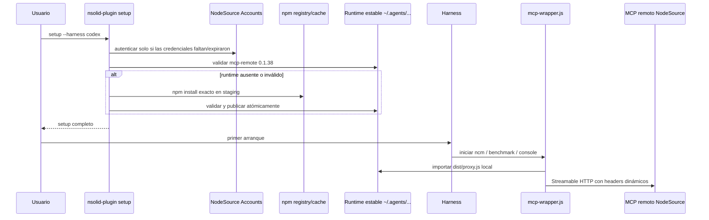

# Design

## Goals / Non-Goals

Goals: provision `mcp-remote@0.1.38` during `setup` into a shared, versioned,
atomic, concurrency-safe runtime; make the wrapper consume only that runtime
(or a version-matched dev checkout copy); make failures fast and actionable;
surface the state in `doctor`; preserve credentials semantics and the current
Accounts OAuth untouched.

Non-goals: native MCP-transport OAuth (tracked as deferred technical debt in
`docs/technical-debt/native-mcp-oauth.md`); automatic pruning of old runtime
versions; byte-for-byte reproducible installs (see Limitations); changing the
Codex 60s startup timeout; offline first-run installation.

## Module Boundaries

### New module: `packages/core/src/mcp/mcp-remote-runtime.ts`

Single ac responsibility: manage the shared bridge runtime under
`getAgentsDir()` (never paths derived from `cwd`). Public (internal-package)
contract:

```ts
export const MCP_REMOTE_VERSION = '0.1.38'

export interface McpRemoteRuntimeStatus {
  status: 'ready' | 'missing' | 'invalid'
  version: string          // pinned version this plugin expects
  root: string             // ~/.agents/nsolid-plugin/runtime/mcp-remote/<version>
  proxyPath?: string       // set when ready
  reason?: string          // why invalid
}

export interface EnsureMcpRemoteRuntimeResult {
  installed: boolean       // false when an already-valid runtime was reused
  version: string
  root: string
  proxyPath: string
}

export interface NpmRunner {
  run(command: string, args: string[], options: { cwd: string; timeoutMs: number }):
    Promise<{ status: number | null; stderr: string; timedOut?: boolean }>
}

export interface InternalRuntimeOptions {
  /** Test-only runner injection; default spawns npm without a shell. */
  runner?: NpmRunner
  /** Override the resolved npm entry point (tests point it at node itself). */
  npmCommand?: { command: string; args: string[] }
  /** Setup-time npm timeout (default 5 min). NOT the Codex MCP startup timeout. */
  timeoutMs?: number
}

export function inspectMcpRemoteRuntime(): McpRemoteRuntimeStatus
export function resolveNpmCommand(): { command: string; args: string[] }
export async function ensureMcpRemoteRuntime(options?: InternalRuntimeOptions): Promise<EnsureMcpRemoteRuntimeResult>
```

`InternalRuntimeOptions` exists solely as the internal testing seam; it is not
re-exported from the package root. `inspectMcpRemoteRuntime()` performs no
mutation, no network and no process spawning.

### Validation ("ready")

A runtime at `root` is ready iff:

1. `root/node_modules/mcp-remote/package.json` parses with
   `name === 'mcp-remote'` and `version === MCP_REMOTE_VERSION` (exact);
2. `root/node_modules/mcp-remote/dist/proxy.js` exists and is a file;
3. the dependency closure is complete: every (non-optional) `dependencies`
   entry of `mcp-remote` and, transitively, of its resolved dependencies
   resolves to a `package.json` inside the runtime, using Node-style
   `node_modules` resolution starting at the dependent's directory and
   walking up to the runtime root. Missing `optionalDependencies` are
   tolerated; `peerDependencies`/`devDependencies` are ignored.

The closure walk is a static probe: it detects missing transitives without
executing package code during setup (important because installs run with
`--ignore-scripts`, so package code has not been vetted/executed yet).

### Install sequence (`ensureMcpRemoteRuntime`)

1. `inspectMcpRemoteRuntime()` → ready ⇒ return `{ installed: false, ... }`
   without invoking npm (idempotence; no network).
2. Create the controlled parent `~/.agents/nsolid-plugin/runtime/mcp-remote/`.
3. Create staging `parent/.staging-<pid>-<uuid>/` (same filesystem ⇒ atomic
   rename is possible) and write a minimal private `package.json`
   (`{ name: "nsolid-plugin-mcp-remote-runtime", private: true }`) so npm does
   not walk up into unrelated manifests/workspaces.
4. Resolve npm (see below) and run, without a shell and with separated argv:
   `install --omit=dev --ignore-scripts --no-audit --no-fund --save-exact
   --no-package-lock mcp-remote@0.1.38`.
5. Timeout: 5 minutes default (setup-time budget, independent of the Codex MCP
   startup timeout). Capture only a bounded tail of stderr (≈4 KiB); never
   dump the environment.
6. Validate staging with the same readiness probe.
7. Publish atomically: `rename(staging → root)`. If the destination exists
   (race), accept the winner when it passes validation and delete only the
   losing staging; if the existing destination is invalid, rename it aside to
   `root.stale-<uuid>` first (so a failed npm run never leaves a worse state),
   rename staging in, then remove the stale copy.
8. Re-inspect the published runtime; on any failure throw a single actionable
   error: setup must end `success: false` and tell the user to re-run the same
   command (credentials may already be stored and must remain valid).

Only paths created by the current operation are ever deleted: the staging
directory and the stale-aside directory. Every recursive deletion target is
asserted to live inside the validated runtime parent.

### npm resolution (`resolveNpmCommand`)

Never consult `PATH`/`cwd` (a project's `node_modules/.bin` must not be able
to substitute npm). Order:

1. `process.env.npm_execpath` when absolute, existing, a `.js`/`.cjs`/
   `.mjs` file, **and npm's own entry point** (basename `npm-cli.js`/
   `npm.js`-style, or located under `node_modules/npm/`) ⇒
   `[process.execPath, <execpath>]` (works under `npx`/npm scripts on every
   platform without a shell). Entries of other package managers (`pnpm.cjs`,
   `yarn-*.cjs`) fall through: they reject the npm flags used here and their
   `node_modules` layouts fail readiness validation.
2. `<dir(process.execPath)>/node_modules/npm/bin/npm-cli.js` when it exists ⇒
   `[process.execPath, <cli.js>]` (standard Windows Node layout; `.cmd`
   shims cannot be spawned without a shell).
3. `<dir(process.execPath)>/npm` when it exists (Unix shim, e.g. Volta) ⇒
   `[<npm>]`.
4. Otherwise an actionable error ("install Node.js with npm").

### Setup / Startup sequence



`setup()` calls `ensureMcpRemoteRuntime()` once, after valid credentials are
available (or immediately when the bundle has no auth section), before any
per-harness install branch — so all five harnesses get the runtime. For
OpenCode/Pi the subsequent direct `install()` only proceeds when the runtime
ended up ready. `install()` itself never provisions or downloads: the rule
"install does not authenticate and does no unexpected network bootstrap" is
unchanged.

### Wrapper contract (generated by `scripts/plugin-generators.mjs`)

- Signature: `node mcp-wrapper.js <serverName> <harness>`. Claude's
  `.claude-mcp.json` passes `claude`; the Codex and Antigravity bootstraps pass
  `codex` / `antigravity` when launching the shared wrapper. Both `serverName`
  and `harness` are validated against allow-lists before any repair message is
  built.
- Resolution order: (1) stable runtime
  `~/.agents/nsolid-plugin/runtime/mcp-remote/<MCP_REMOTE_VERSION>/node_modules/mcp-remote`,
  validated (name, exact version, `dist/proxy.js` is a file); (2) development
  fallback `createRequire(import.meta.url).resolve('mcp-remote/...')` accepted
  only when it validates against the same pinned version; (3) otherwise fail
  immediately (non-zero) with
  `[nsolid-plugin] MCP bridge runtime is not ready. Run: npx -y nsolid-plugin setup --harness <harness>`.
- URL and headers are handed to the imported proxy as separate
  `process.argv` elements; no shell, no `spawn`, no `cmd.exe`, no `npx`
  anywhere in the wrapper. The Unix `npx` fallback, the Windows
  `npx.cmd`/`cmd.exe` bootstrap/payload machinery and its resolution helpers
  are deleted.
- `MCP_REMOTE_VERSION` is exported by the generator and kept in sync with the
  core module and the root `package.json` dependency by a unit test.

### Doctor

`DoctorReport` gains an optional, backward-compatible `bridge` entry:

```ts
bridge?: {
  status: 'ready' | 'missing' | 'invalid'
  version: string
  root: string
  proxyPath?: string
  reason?: string
  /** true when this harness's MCP servers are actually served through the wrapper */
  required: boolean
}
```

`required` is true only for wrapper-owned configurations: claude, codex and
antigravity **with their native plugin detected** (the plugin's MCP config is
the wrapper). A missing/invalid runtime with `required: true` pushes an error
(`Run: nsolid-plugin setup --harness <harness>`), marks the bridge line red
and makes `healthy: false`. For OpenCode/Pi — and for direct/fallback
installs of the plugin-owned harnesses, whose MCP config is native HTTP — the
bridge line is informational and never affects health. "Bridge runtime ready"
is reported separately from the existing MCP-config/endpoint checks: a ready
proxy never implies the remote MCP is reachable.

Human output gains a `MCP bridge` line; `--json` simply carries the new
optional field (documented in `packages/core/README.md`).

## Concurrency & Failure Model

- Two setups racing: both stage independently; the first `rename` wins; the
  loser re-inspects, accepts a valid winner, deletes only its staging. If the
  winner is invalid (e.g. crashed mid-publish in an older/other process), the
  loser replaces it via rename-aside while its own staging is already valid,
  so the on-disk state never gets worse.
- npm failure/timeout: staging is removed; any previously valid runtime is
  untouched (we never delete the destination before staging validates);
  `setup` returns `success: false` with `MCP runtime setup failed: …` while
  stored credentials remain valid for retry.
- Interrupted install: the destination only ever appears via a single atomic
  `rename` of a fully validated staging tree, so partial runtimes are never
  published; a leftover `.staging-*` sibling is inert and ignored by probes.

## Lifecycle / Migration

- `uninstall --harness X`: removes X's artifacts only; the shared runtime is
  untouched (other harnesses may still need it, including older plugin
  versions pinned to a different runtime version).
- `logout`: credentials only, as today.
- New plugin version pinning a different `mcp-remote`: installs a sibling
  versioned directory; old ones are kept (no auto-pruning; a cleanup policy
  can be designed later).
- Existing users: after updating/reinstalling the plugin they run
  `npx -y nsolid-plugin setup --harness <harness>` once before opening a new
  session. If they skip it, the wrapper fails fast with the repair command
  instead of hiding the problem behind an npm download.

## Security Notes / Limitations

- The runtime directory contains no tokens, authenticated URLs or headers;
  credentials stay exclusively in `~/.agents/.nodesource-auth.json`.
- npm runs with `shell: false`, separated argv, `--ignore-scripts`, and only
  inside the staging directory; stderr capture is bounded and never includes
  the environment.
- Exact-pinning `mcp-remote@0.1.38` does not freeze its transitive
  dependencies declared with ranges: two cold installs may differ in
  transitives. A dedicated lockfile/shrinkwrap or a bundled artifact would be
  needed for byte-exact reproducibility; documented as a known limitation, not
  solved here.
- First run still needs network (npm registry) — the fix makes the download
  explicit and moves it out of harness startup; it does not make setup fully
  offline.
